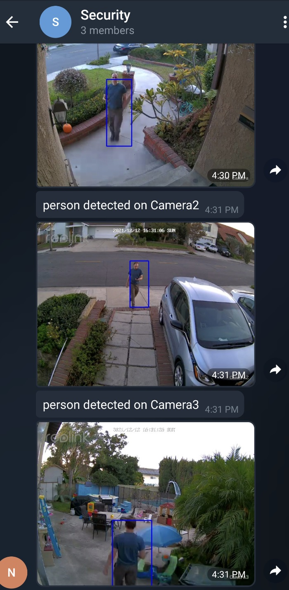
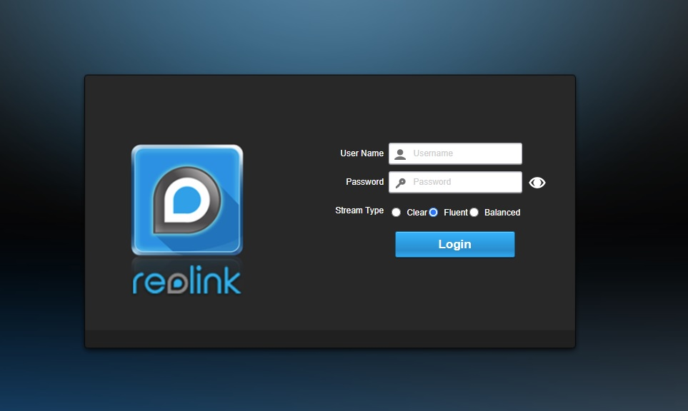
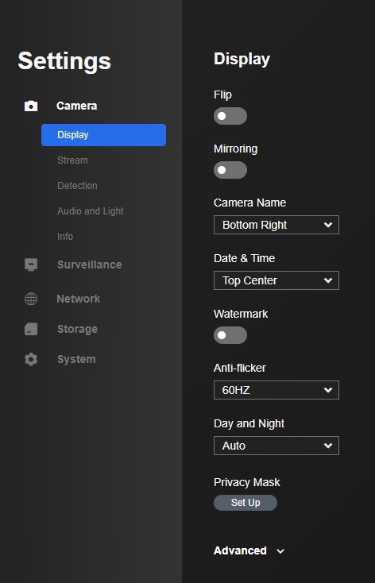
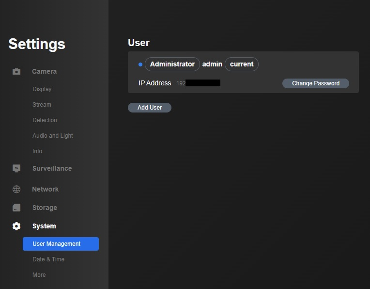

# Ditigally Secure Home Security  

This is a project that uses IP cameras, local computing and the encrypted messaging app Telegram to monitor a location and get notifications on your phone or desktop without sending any usable data to outside companies.

The end result will be notifications on your phone that looks like this:



## Summary 

This is a privacy focused attempt at building a Ring/Arlo replacement using higher quality, less expensive cameras and a raspberry pi to monitor for motion and object detection.  The goal is to provide faster response times without compromising any data or allowing any company to profit off of your feed.

## Why do this?

I took issue with my Ring doorbell sending out false positive notifications even after attempting to tune the sensitivity.  The notifications were both slow and unreliable so whenever I opened up the notification by the time the stream connected there was rarely anything on the screen.  This meant if I was actually interested in what was at the door I would almost always need to open the app, go to the list of previous interactions and then start streaming that video.  The whole process takes maybe 20-30 seconds but it would happen several times a day and often it was just a gust of wind, which made the Ring doorbell more frustrating than it was worth.  Add the subscription cost to view recorded previous interactions and I wanted to come up with a cheaper and better process. 

There are also security issues with police/federal agencies getting access to Ring/Amazon's recorded data without the permission of the home owner. The fact that the device you bought records data you don't own and is used by a company for training their proprietary AI and other internal testing means that you don't own the data generated by the device you bought.  Overall retaining the ownership and privacy of your data should be taken more seriously and hopefully this project can contribute to that. 

## How is it better than alternatives?

The response rate is dependent on how many cameras there are attached, but with fewer than 8 cameras the notifications come in significantly faster than when I was using Ring.  With 4 cameras, text notifications come in after about 500ms and images are delivered in under 2 seconds (this will be dependent on your data connection though).

The setup is cheaper though it requires some setup.  Ring has bundles with 4 cameras for $400 + tax plus a subscription of $100 a year.  Arlo has options that run from $600 to $1000 + tax plus a subscription of $10 a month.  My entire setup cost $291 + tax, most of the bonus features you pay the subscription for are possible to do locally with a little more work, shown at the end of this page.

* Reolink cameras (often on sale for $40)
* Raspberry pi 4 (any version, RAM isn't an issue) starts at $35
* 8+GB microSD ($5)
* Power over Ethernet (PoE) network switch (I used TL-SF1008P which supports 4 cameras) $50. Make sure you have enough PoE slots to power the cameras.
* Networking cables (varies on length/number of cameras, mine cost $36, $5 for caps, I borrowed a cat5 crimper)
* Mini hdmi connector to monitor ($5)

## How does it work?

This project relies on three main pieces of open source code.  The first is the reolinkapi which is [available here](https://github.com/ReolinkCameraAPI/reolinkapipy).  This allows us to monitor the rtsp stream within python and analyze the frames from our cameras. The second is [OpenCV](https://github.com/opencv/opencv) which is used for computer vision, in our case to serve as a motion detector using background subtraction.  Third is [ncnn](https://github.com/Tencent/ncnn) which is a neural network framework built by Tencent which is being used to perform object recognition on the images that are passed in.

### Object detection

The ncnn library is an optimized neural network processing engine. There are many prebuilt networks that are packaged with the library and we will be using [mobilenetv2_ssdlite](https://machinethink.net/blog/mobilenet-ssdlite-coreml/) which is math magic that quickly is able to identify objects from the [coco dataset](https://tech.amikelive.com/node-718/what-object-categories-labels-are-in-coco-dataset/).  There are 91 different types of objects that this network is trained on.  These include things like person, cat, dog, car, truck, cow...

In the parameters section of the setup.conf file there is a list of the objects that the network will be searching for.  If you are on a ranch and want to search for cows and sheep you can remove person and add cows and sheep.  You can replace mobilenetv2_ssdlite with a different network in the runHomeSecurity.py file but that one is the best combination of speed and accuracy that also works in black and white (which is use in the night vision mode of the cameras).

### Filters

Since the raspberry pi will be processing several frames per second from every camera we can't send out a notification/image on every frame that a object of note is detected.  I have a couple of filters to verify that we want to be informed about the object.  

The first filter is on the motion detection, there is a sensitivity parameter that measures how much of the image is different from the expected (no objects detected) state.  The lower the threshold on this filter the more sensitive it is.  A value of 1 means that if 1 pixel is different from the expected background data the image will be reported as motion detected, even an empty/static scene can give results as high as 150 so a threshold below that will be very sensitive.  A value of 2000 is the default which means that close to 3% of the image has changed in some obvious way.  Depending on the location of the camera it could make sense to increase this as high as 10000 if you did not want the camera to be very sensitive.

The second filter is the timeout system.  If an object has been detected by a camera we do not want to report it on every subsequent frame.  The default value is 15 seconds of timeout where that camera is not allowed to report the same type of object.  After the timeout is completed the camera can report again.

The third filter is the minimum object size.  This is a parameter that can be tuned that gives a minimum size for an object to be reported to the group.  If the camera is oriented in a way that would allow for distant objects to be detected this will cut down on unwanted notifications.


## How secure is it?

The whole point of this project is data privacy so it better be secure.  Since everything is hard wired we are protected from wifi sniffing.  The cameras have a built in admin account with no password so that will need to be changed during the setup detailed below.  The raspberry pi will be password protected but it starts with a known username and password, I also encourage updating the admin password and using a different username/password.  The end to end encryption of the messages/images being sent out is highly secure.  The most insecure part of this process is the setup.conf file that needs to be user made during the setup process.  

There are ways to properly encrypt this file but I am not a security expert so I am open to suggestions.  I know if I attempt to do this myself I will break some protocol and it won't actually be secure.

All in all there is no outside company with access to your camera feed and there is no outside data processing.  The only data that leaves your local network is encrypted so it is of no use to any attacker.  The most vulnerable part of this setup is the plain text password file on the password protected raspberry pi inside your local network. 

Note: the ncnn processing library is developed by Tencent which is a Chinese company.  In general Chinese companies have a bad track record for data security and connections to the government meaning that any data given over to them is suspect.  I have looked through the code in the ncnn library and I see nothing there that is anything but a local neural network processing library.  It appears to be fully legitimate. 


# Setup

Things that you will need:

* Reolink cameras, as many as you want, but I have not tested the responsiveness above 4 cameras
* Raspberry pi 4 (any version)
* 8+GB microSD
* Power over Ethernet (PoE) network switch
* Networking cables
* A way to mount your cameras (drill, screwdriver, etc)
* A telegram account, or just make a new one
* Mini hdmi connector to monitor (expert mode: use ssh for the whole thing)

## Install the Cameras

Make sure you have Reolink cameras because the interface that we use to monitor the streams only works for Reolink.
At the bottom of [this page](https://github.com/ReolinkCameraAPI/reolinkapipy) the current supported camera models is listed, I used RLC-410-5MP cameras. 

This requires drilling and mounting the cameras, and running the networking cables to the PoE switch.  You can use a non-powered switch if you have a power adapter for each camera, but power is not always available where you want to plug in the camera.  Wire your PoE switch to your router if you are going to be using separate devices. 

Camera install may be the most time intensive part but there's nothing I can do to help with that.

## Setting up Raspberry pi 

We are going to be monitoring the camera feeds and running code on the raspberry pi so the first step is set up the raspberry pi.

This requires following [this guide](https://projects.raspberrypi.org/en/projects/raspberry-pi-setting-up/2).

Finish setup to get to the desktop or terminal depending on your preferred settings.

## Setting up the main script

On your raspberry pi, open a terminal window and run the following lines:

```
sudo apt-get install python3
sudo apt-get install git
git clone https://github.com/kennybradley/security.git
cd security
pip3 install -r requirements.txt
```

You will now have the script downloaded along with all of the dependencies, the code is ready to run, but we need to set up the files necessary to start sending out notifications. 


# Setting up telegram

## Part 1 : generate a token

Make/log in to a telegram account, you'll need a phone but you can also do this in a browser.

Send the following messages to the user BotFather: 

* /start
* /newbot
* UniqueNameOfNotification_bot

This will give you a token.  We will be using this to set up our notifications.

It will look something like this 1234567890:ABCDEFGHIJKLMNOPQRSTUVWXYZ123456789

## Part 2 : Set up your pi to send messages

On your pi will need to set up the program telegram-send:
```
pip3 install telegram-send
telegram-send --configure
```

Insert the token that Part 1 gave you.

This will ask you to search for UniqueNameOfNotification_bot on telegram and send a number to confirm setup. Confirming this will allow the raspberry pi to send messages through the bot you just made.

## Part 3 : Getting the group ID 

Being able to send messages is good but sending requires a group ID.

Login on [the web based telegram site](https://web.telegram.org/), it MUST be the web based site.  This will ask you to verify with your phone, go into the telegram app settings, then devices, and click on Link Desktop Device.

At the bottom click on the pencil. 


Then New Group Chat.  


Add your UniqueNameOfNotification_bot and add whoever you want to be receiving notifications.


Click on the group chat and the URL bar should look like this: https://web.telegram.org/z/#CHARCTERS_HERE

Everything after the # is your group chat ID, you'll be needing this.

## Part 4 : Finish telegram setup

We need to write out the token and the group chat ID.  Change directories to the security script folder, using my suggested setup: cd /home/pi/security

Update the setup.conf file with the token and group ID.  Open up using gedit by gui or nano/vi/emacs by command line.

Add the token so that it looks like TOKEN=1234567890:ABCDEFGHIJKLMNOPQRSTUVWXYZ123456789
Add the group ID so that it looks like GROUP_ID=CHARACTERS_HERE

# Get the camera IP addresses

In your router (maybe at 192.168.0.1) you'll need to pull up the IP addresses of the cameras that are plugged into the switch.
I can't help too much with this part since each router is set up differently.  You want to look for hard wired connections set up within the last day. 

Grab those IP addresses, you're going to need to log into each camera to set up passwords.

You will also need to go into the router settings and set the camera to have a static IP address.  This means that your router will make sure that the cameras keep the same address so you don't get disconnected from the camera after days/weeks.  

## Configuring the cameras

Insert the IP address into a web browser and you'll be given a landing page to log into the camera.  



The default username is: admin
The default password is empty so leave it blank. 


After you log in click on the gear in the top right.



Then on the left side click on System then User Management.  This will allow you to insert a new password. If you choose to add a new username remember to also reset the password of the admin login.  You don't want to leave that blank.



Update the section of the setup.conf from 
```
IP_ADDRESS=[]
USERNAMES=[]
PASSWORDS=[]
```
to the corresponding login information such as:
```
IP_ADDRESS=[192.168.0.51, 192.168.0.52, 192.168.0.53, 192.168.0.54]
USERNAMES=[userCam1, userCam2, userCam3, userCam4]
PASSWORDS=[pass1, pass2, pass3, pass4]
```

# Finally Running 

## Sanity check

We set up the telegram-send and the bot, we generated a token, a group ID, and set of IP addresses, usersnames and passwords.  Everything should be ready to run.

## Running natively

Open the terminal and 
```
cd /home/pi/security
python runHomeSecurity.py
```

It should give a little bit of output saying that each of the cameras connected.  Feel free to disconnect the monitor cable and let it run.
If you lose power or it gets reset for some reason simply repeat the two lines above to restart the program.

## Running remotely

You can connect to your pi from a windows or other computer by using ssh.  

```
ssh pi@IP_ADDRESS_FOR_PI
```

Log in, then install tmux so we can run the script remotely 

```
sudo apt-get install tmux
tmux
```
Tmux will make a new screen that will persist even after you log out.
The new screen:
```
cd /home/pi/security
python runHomeSecurity.py
```
Then hit control+b followed by d.  This will leave the program running on the pi and allow you to exit the terminal 

# Additional functionality to compete with subscriptions

* Set up an FTP server for recording.  In the menu for the cameras you can record to a ftp server in low or high quality.
  * For the fluent/low quality images a block size of 75 MB puts the recording around an hour.
  * This can be done on the raspberry pi with an external hard drive, Seagate and Western Digital often have 4 TB drives for $100 or less. 
  * For my case, 4 cameras on low quality (fluent) mode it records just over 7 GB per day, but at full resolution (clear) mode it would record 250+GB per day
  * Permanent recording for 4 camears at full quality on a 4TB hard drive would only last around 15-16 days before old data needed to be overwritten.
  * On low quality mode that 4 TB drive would last well over 500 days.
  * I wrote a script that runs once per day and checks if the size of the recorded data is over a limit and deletes the oldest recording.
  * To set up a raspberry pi server [this is a good tutorial](https://medium.com/kunalrdeshmukh/ftp-server-with-raspberry-pi-and-hdd-3c10ce95f2d4), you can start at "Step 5: Mount HDD" even though its actually step 3.

* Port forwarding for external viewing
  * This tells your router that incoming requests from a certain port are designed to go to certain cameras.  
  * The normal port for rtsp video streaming is 554.  So pick another port and assign a port forwarding entry for a particular camera's IP from that port to 554.
  * Then you can set up a remote viewing app that allows rtsp.  On mobile tinyCam is popular, and on desktop you can use VLC.  All you need to do is set up the port and connect to your home IP using that port and your camera's username and password. 
